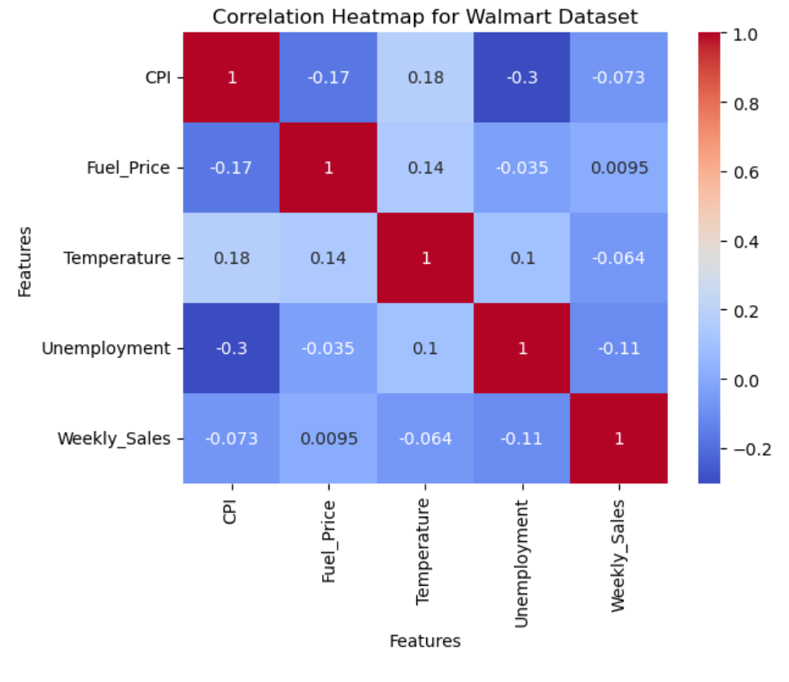
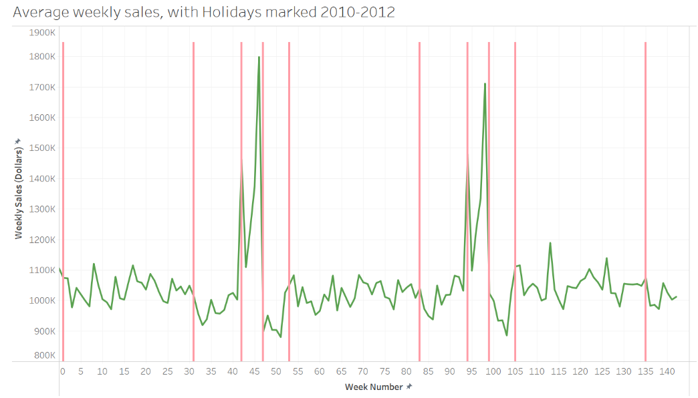
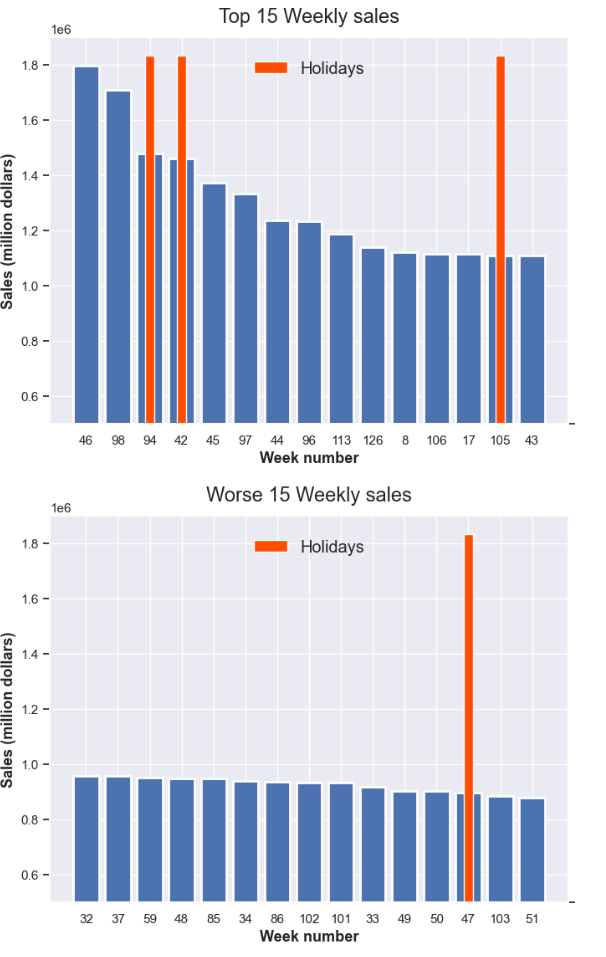
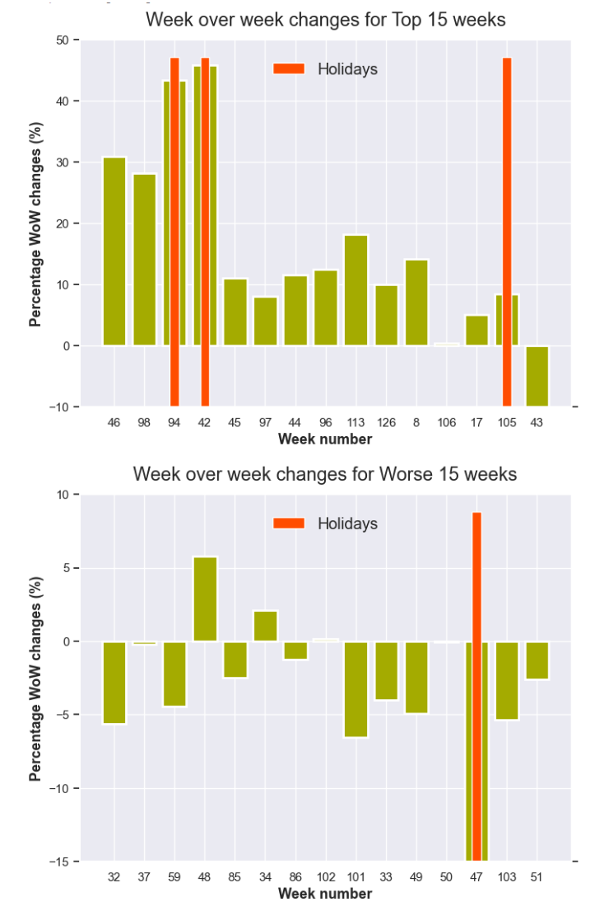
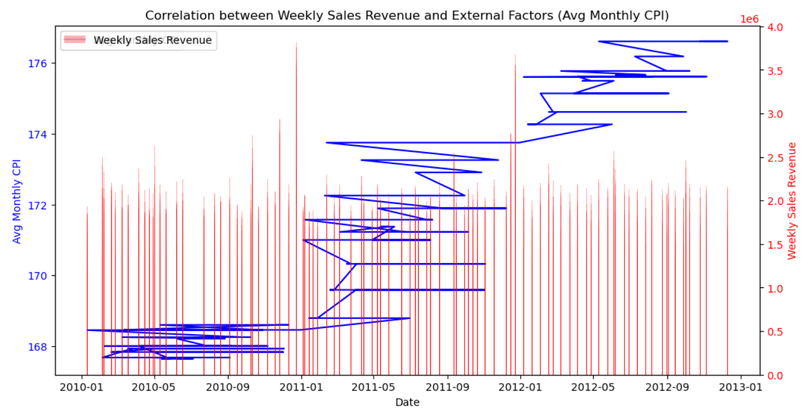
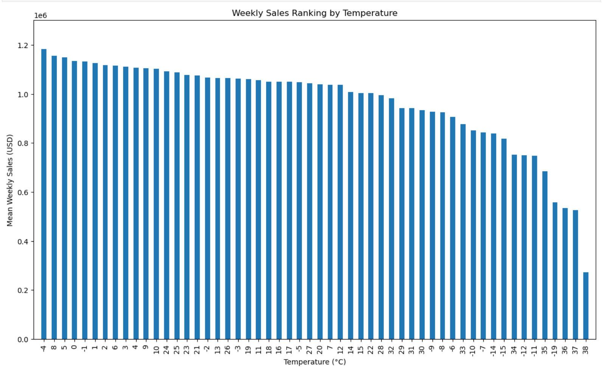

# Group 36 - {Walmart Sales - To See the Future, Look at the History}

## Introduction:

Our project is based on a sales analysis dataset for 45 Walmart locations for almost every week from February 5th, 2010, to November 1st, 2012 where weekly sales, fuel price, consumer price index, temperature, and unemployment rates are compared. Our group realized that understanding and being able to see the correlation in company’s sales data is incredibly beneficial for these companies as it can help guide them through future objectives and financial uncertainties. This is especially helpful for Walmart’s daily decision-making, as if its procurement department understands the link between consumer behaviour, trends, and gas prices, it can order an accurate number of products. We also wanted to work on this dataset as analyzing a company’s sales performance encompasses all of our group members’ financial interests. Michael's research interest revolves around economic environmental effects on industry performance. Kobe’s research interests involve company financial reports and trend predictions, and Fumiya’s research interests are consumer behaviour and price sensitivity. We also are interested in Walmart, as it is a store we all shop at frequently,  here in Kelowna, British Columbia. 

## Exploratory Data Analysis: 
Our dataset has a wide range of data from the individual store locations. Some of the stores were top performers, earning an average weekly sales of over 2 million dollars, and others were on the bottom end, scraping less than half a million in average weekly sales. Although all store locations had different sales amounts, the peaks and the lows of each store's weekly change in sales tend to stay consistent with each other, fluctuating always in similar trends and patterns. Our first graph below shows these ranges.

### Walmart Store's Weekly Sales

performers as the last 5 store  trend lines. The two massive spikes both start in late November and end during the middle to end of December. In order to clean this up, we took the average of all the stores weekly sales and plotted them, shown below.

### Walmart's Average Store Weekly Sales 

Here it is easier to see the individual weekly fluctuations in sales. With the second largest spike in sales happening the last week of November, and the largest spike happening mid December, showing how heavily the Christmas holiday season affects consumer’s shopping behaviour. Throughout the remainder of the year it is seen that fluctuates are constant, but they tend to be more steady and similar in change. 
Furthermore, we visualized our database by a heatmap to identify the relationship between all variables. This heatmap gives us a idea of which variables affect weekly sales.

### Correlation Heatmap for Walmart Dataset 

As you can see from the above graph, it appears that CPI, fuel price, temperature, and unemployment have a marginal impact on weekly sales.In other words, these external factors do not greatly affect Walmart’s profitability. However, we will precisely discover which factors affect Walmert sales by extensively researching each relationship.

## Research Question 1

### Can Walmart's future sale predictions be accurately made using estimates based on only their store location’s past historical sales?

This visualization is used to see the trending changes that happen throughout the year, to see if they stay consistent with each other. It is very evident that the stores highest sales come from the Christmas holiday season, shown with the yearly spike in the sales ROC during the end of November to the middle of December. There is also a decline in the sales ROC in January, following the holiday, and expectable increases around the summer season (June and July) and the school season (End of August to the start of September). The weekly sales ROC supports that these changes in weekly sales follow yearly repeated trends. This proves that sales vary by the date, and seasonality/holidays is one of the majour causes. An average of these week to week rate of change was taken and applied to each individual week to derive our predictions

Here the sales have been broken down into the individual year, and separated by week number where 0 is the first week of January and 52 is the last week of December. It is clear that the predictions made for 2012 are quite similar to the actual sales of 2012, and are very similar to the weekly trends of every year. Here we can see that the predictions match the lower than average January sales, represented by weeks 1 to 4. Then the weekly values stay consistent in their small fluctuations throughout the year, until it finally hits its first peak at the end of November, represented by week 46. These predictions seem accurate, but a direct comparison will show the exact differences in their trends.  

Throughout the year, the 2012 predictions (red line) stay steadily consistent with the actual values from 2012 (blue line). This shows how future sales can be predicted based on past historical sales, within a reasonable range of the actual sales. For these calculations, the variance from the real values in this case was calculated to be $25,473, which is not bad when we're considering millions in sales. 

Overall, there are many factors that go into predicting future sales and their trends. By ignoring outside elements and only using past recorded sales, a gross simplification of a prediction formula can be derived. My research question being "Can Walmart's future sale predictions be accurately made using estimates based on only their store location’s past historical sales?" is trying to see that even after we have simplified a trend prediction, can it still be somewhat accurate. The findings tell us that yes, these future sales can be predicted with past sales and sales growth rates somewhat accurately. The predictions made for each week of 2012 had an average difference from the actual sales of $25,473, which is only a 2.5% percent difference when dealing with over a million dollars per week in sales. The sales predictions also followed a similar pattern to the actual sales throughout the year, peaking at late november/mid december, with consistent small fluctuations throughout the year. This analysis could potentially be used to continue to predict future years sales. 

## Research Question 2

### How are sales affected by holidays, and is it possible to predict exceptional good/bad sales based on existing holidays, or the neighboring weeks of sales?

The data indicates that the average weekly sales of 45 stores generally fluctuate around a small range of 0.9 - 1.1 million. However, looking at the line graph, there are exceptional periods where big jumps or dips in sales are seen. Holiday periods marked with the red lines, appear to be aligned with the biggest jumps in sales.

By separating out the 15 best weeks and 15 worse weeks of sale, we can see that three of the weeks that have a holiday lies within the top week. One exception is week 47 being one of the worse weeks, this could be the result of the preceding week being the highest week of sales. We could estimate that there might have been a change in operating strategy and there was a presale, resulting in a rebound in consumer demand. 

In this chart, we have showcased the week-over-week percentage(percentage change of the current week's sales compared to the preceding week) for the best and worse weeks. We can see that almost all of the best weeks have a big positive percentage, indicating the best weeks were a big jump compared to the preceding week. Most of the WoW percent for the worse weeks is negative, indicating the worse weeks of sales saw a big decrease compared to the preceding week. It seems that monitoring the WoW change indicator might not help identify potential sales trends due to the unpredictable fluctuations.

In conclusion, holidays do seem to affect sales positively, and we can assume that would be the case for future operations. We also can conclude that the neighbouring period will not have that much of a say in predicting the current sales, since that big jump and fall in sell occurs through sudden changes. 

## Research Question 3

### To what extent does inflation and temperature affect consumer behavior?

Based on our exploratory analysis, it appears that both inflation and temperature have a marginal impact on consumer behavior. Specifically, the heatmap shows a negative correlation of -0.073 between sales revenue and CPI, indicating that as inflation increases, sales revenue may slightly decrease due to the higher prices associated with inflation. This implies that consumers may change their purchasing behavior in response to inflation. Similarly, the heatmap displays a negative correlation of -0.06 between sales revenue and temperature, indicating that consumers may also be influenced by temperaturel.

It is important to note, however, that these correlations are relatively low, suggesting that Walmart's goods and services are essential for their customers from the graph above. By showing that despite the increase in the average monthly CPI, weekly sales have remained relatively stable. This suggests that customers view Walmart's products as necessities and are willing to continue purchasing them despite external economic factors such as inflation.

The bar chart provides additional insight into the impact of temperature on consumer behavior, indicating that extreme temperatures, such as above 35 degrees Celsius and below - 10 degree Celsius, may reduce weekly sales. This could be due to the fact that customers are less likely to visit the store in such conditions. 

Overall, while inflation and temperature do have some influence on consumer behavior, the relatively low correlations suggest that Walmart's goods and services are essential for their customers, and external factors do not significantly alter their consumer behavior.

## Conclusion

To summarize, our analysis reveals that past sales data and growth rates are useful in predicting future sales trends, with our prediction model aligning closely with actual sales patterns. The positive impact of holidays on sales is likely to persist in the future, while neighboring periods have a negligible effect on sales predictions, as sudden changes in sales occur independently of surrounding periods. Nonetheless, external factors such as inflation and temperature can influence consumer purchasing behavior and should be taken into account when making sales predictions. Our research suggests that Walmart's products are considered necessities, leading consumers to continue purchasing them despite economic challenges. While the correlation between these external factors and sales is relatively low, their potential impact should not be disregarded. A comprehensive understanding of these factors can aid businesses in making informed decisions and optimizing their sales strategies.

The research findings have broader implications for businesses beyond Walmart. Analyzing past sales data and growth rates can provide valuable insights into predicting future sales trends, especially during holiday periods and times of extreme temperature. Furthermore, emphasis on external factors such as inflation should be taken, since they could potentially influence consumer behaviour. Overall, a comprehensive understanding of past sales data, growth rates, and external factors can help businesses make informed decisions and optimize their sales strategies for long-term success.
